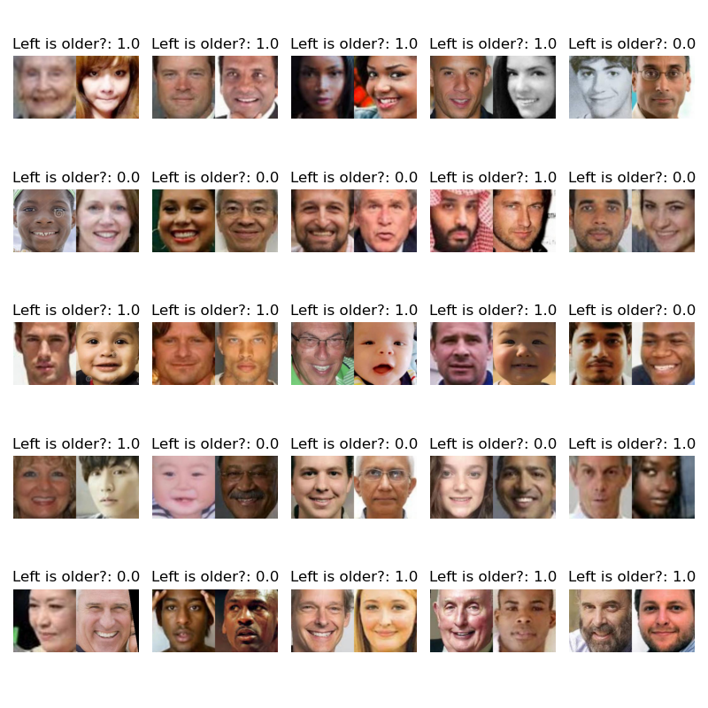
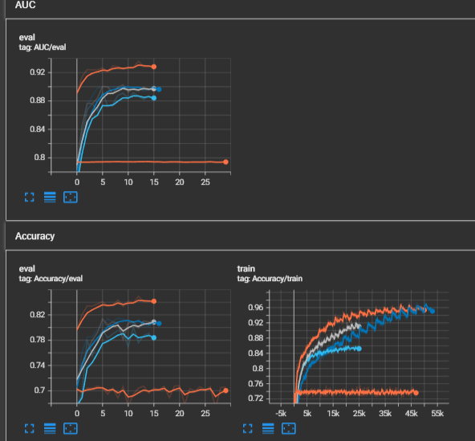

# Project Assignment

A.A. 2022/2023
Deep Learning and Generative Models
Project assignment #6

## Project objective:

- Train a model that, given two face images, outputs who is younger and who is older.

## Dataset:

- UTK-Face: https://susanqq.github.io/UTKFace/

## Network model:

- A standard CNN such as VGG or ResNet should work

## Detailed information:

- The model should not predict the age, but can be trained to do so if useful;
- Use UTK-face to build a custom dataset with relation labels (younger, older) associated to the face pairs.
- Many different solutions are possible. Two options are:
  - Modify the CNN to receive as input two images and train it as binary classifier;
  - Train the CNN as age estimator and use it as feature extractor to compare 2 latent vectors corresponding to two faces by training a simple MLP.

## Additional notes:

- Two images can be concatenated in the channel dimension to form a single tensor

# Project solution

The idea is to train a model that classify if the "left" image is the older one (1) or if the "right" image is the younger one (0).
An example of the training set is shown here:



# Main

Everything is done by the main, except the split of the dataset, it has a lot of parameters, to see all use `main.py -h`

The parameters can be specified inside a config file. Examples of config file can be found inside the directory `Config/`, the config file can be passed to the main using this command `python main.py --config path_of_config`.

The config files doesn't have to specify all the parameters, because it is allowed to use both the config and the arguments like this `python main.py --config path_of_config --run_name Test`

> Note: Keep in mind that if a parameters is passed both inside the config and as argument, the latter overwrites the former

# Dataset

The UTKFace dataset isn’t provided inside the repo, but `split_dataset.py` can be used to split the dataset in 3:

- Train set
- Validation set
- Test set

This script must be executed before the `main.py`

## UTKDataset class

The UTKDataset is higly configurable with this input parameters:

- `root_dir` is a string representing the directory containing the images.
- `transform` is an optional transform to be applied to each image in the dataset.
- `seed` is an optional seed for the random number generator.
- `year_diff` is the minimum age difference between images in the dataset.
- `data_size` is the size of the dataset. If data_size is `None` or negative, the dataset will be the maximum possible size. If `unique_images` is `True`, the required size of the dataset may not be reached.
- `duplicate_probability` is the probability of duplicating a combination of images by switching the order. The duplication will result in a dataset that is larger by a factor of 1 | duplicate_probability.
- `unique_images` is a boolean indicating whether or not to use each image only once in the dataset.

The model proposed are trained with:

- `unique_images` to false, to be able to propose more combination example to the model
- `year_diff` equal to 1, to put the model in the most difficult case
- `duplicate_probability` equal to 0, to avoid putting to many duplicates
- `data_size` equal to 100k, to keep the training time reasonable

This parameters has been chosen to improve the number of combination examples shown to the model

## UTKAgeDataset class

This is a simpler custom dataset class that returns all the images inside the directory and their age.

# Solver

## Basic Solver

This is a basic solver that train the model with the given loss, it has the following input parameters:

- `train_loader`: Loader using during the training,
- `test_loader`: Loader using during the evaluation, or by the method `test()`,
- `device`,
- `model`,
- `writer`: Tensorboard writer,
- `args`: other parameters passed by the user used to load the model, load the checkpoint path and other solver parameters.

This solver implements early stopping using a parameter called `patience`, if the model hasn’t improved on the validation set for `patience` epochs, it stops the search for a better model. <br/>
The solver can also resume a training from the last iteration.

> Note: To really resume as in the last run, the same seed must be provided

The solver also provide two usable loss, MSELoss and BCELoss. The MSELoss is used for training the Age Regressor, for the images classification the BCELoss has been used.

## AutoSolver

This solver is able to search for hyperparameters autonomously. To use this solver the package ray[tune] must be installed.
The solver uses this search space:

```python
self.config = {
    "lr": tune.loguniform(1e-4, 1e-1),
    "batch_size": tune.choice([4,8,16, 32, 64,128]),
    "hidden_layers": tune.choice([[],[64, 32, 16], [128, 64, 32], [256, 128, 64], [512, 256, 128]]),
    "use_dropout": tune.choice([True, False]),
    "dropout_prob": tune.uniform(0.1, 0.7),
    "weight_decay": tune.loguniform(1e-6, 1e-2),
    "resnet_type": tune.choice(["resnet18", "resnet50"])
}
```

It has the following input parameters:

- `training_set`
- `test_set`
- `val_set`
- `model_class`
- `writer`: Tensorboard writer, currently not used
- `args`: To pass other parameters as args.checkpoint_path and args.run_name

# Model

## SiameseResNet

This model consists of two identical ResNet use to extract a feature map from each image, the feature map are then flatten, concatenated and passed to a FC layers to classify if the left image is older or not.

## ResNetClassifier

This model consists of a ResNet that takes as an input a image with 6 channels, this image is composed of the two images concatenated along the channel axis, at the end of the resnet there are FC layers to classifyt if the left image is older or not.

## SiameseResNetAge Classifier

This model is very similar to the SiameseResNet, but it uses a pretrained age regressor ResNet model.
During the training the model will only train the FC layers and not the ResNet.

# Hyperparameters Search and model comparison

## THIS MUST BE UPDATED WITH NEW DATA WITH NEW SPLIT_DATASET.PY, TO GET THE REAL RESULTS, WAIT 2/3 DAYS

This experiment has been produced by the AutoSolver using Ray Tune.
All the models have been trained using the following dataset dimension:

| Dataset        | Dim  |
| -------------- | ---- |
| Training set   | 100k |
| Validation set | 5k   |
| Test set       | 5k   |

## SiameseResNet

| Trial name            | batch_size | dropout_prob | hidden_layers   | lr          | resnet_type | use_dropout | weight_decay | iter | total time (s) | loss        | accuracy   | AUC          |
| --------------------- | ---------- | ------------ | --------------- | ----------- | ----------- | ----------- | ------------ | ---- | -------------- | ----------- | ---------- | ------------ |
| \_\_train_766d1_00000 | 64         | 0.200681     | [512, 256, 128] | 0.00528511  | resnet18    | &cross;     | 5.06796e-05  | 10   | 3538.22        | **0.36129** | 0.8382     | 0.92661      |
| \_\_train_766d1_00001 | 32         | 0.419782     | [512, 256, 128] | 0.000180967 | resnet50    | &check;     | 1.34209e-05  | 2    | 1783.62        | 0.379791    | 0.8254     | 0.915661     |
| \_\_train_766d1_00002 | 64         | 0.205812     | [512, 256, 128] | 0.008269    | resnet50    | &check;     | 7.60351e-06  | 1    | 763.975        | 0.693145    | 0.5028     | 0.513611     |
| \_\_train_766d1_00003 | 32         | 0.269371     | [512, 256, 128] | 0.0169636   | resnet50    | &check;     | 4.10899e-05  | 1    | 883.861        | 0.69451     | 0.5        | 0.492005     |
| \_\_train_766d1_00004 | 16         | 0.532978     | [64, 32, 16]    | 0.000643042 | resnet18    | &check;     | 5.92368e-06  | 1    | 542.341        | 0.545377    | 0.7388     | 0.802306     |
| \_\_train_766d1_00005 | 32         | 0.340338     | []              | 0.00247932  | resnet18    | &check;     | 5.58359e-06  | 8    | 3337.3         | 0.419124    | **0.8468** | **0.933059** |
| \_\_train_766d1_00006 | 32         | 0.255038     | []              | 0.00310665  | resnet50    | &check;     | 0.00173744   | 1    | 877.559        | 0.536702    | 0.7278     | 0.806702     |
| \_\_train_766d1_00007 | 4          | 0.264651     | [512, 256, 128] | 0.00170083  | resnet18    | &check;     | 0.000681391  | 1    | 1632.84        | 0.695752    | 0.5        | 0.503657     |
| \_\_train_766d1_00008 | 64         | 0.433996     | [64, 32, 16]    | 0.000605203 | resnet50    | &cross;     | 0.00189003   | 2    | 1524.46        | 0.454667    | 0.778      | 0.86682      |

The model with the lowest loss is a ResNet18 with [512,256,128] as hidden layers, but the model with the highest accuracy and AUC is a simple ResNet18, so, regardeless the loss value, this is the best model overall.

The ResNet18 without any hidden layers has been retrained from scratch, using the parameters suggested by Ray[tune] obtaining this result:

| Dataset    | Loss                | Accuracy           | AUC        |
| ---------- | ------------------- | ------------------ | ---------- |
| Validation | 0.33637078761295147 | 0.8409633757961783 | 0.93242656 |
| Test       | 0.315411420859349   | 0.8564888535031847 | 0.9403736  |

> The Test performances are, oddly, slightly higher, this is easly explainable by the fact that the dataset contains people of different ethnicity and gender.
> The `split_dataset.py` splits keeping the age distribution equal between train, val and test set, but the other parameters are ignored, so an "unlucky" split could have created a test set more similar to the training set than the validation set.
> In my opinion this is not a problem, because, the performances are so good that a slightly decrease in a new enviroment, due to different ethnicity and gender distributions, would not be so impactufl. <br/>
> Indeed in [492726adb0fa072b98819df9b59ae756a41f8cd2](https://github.com/ErgastiAlex/UTK_FaceComparison/tree/492726adb0fa072b98819df9b59ae756a41f8cd2), where the dataset was splitted without the random shuffle the performances were
>
> | Dataset    | Loss                | Accuracy           | AUC        |
> | ---------- | ------------------- | ------------------ | ---------- |
> | Validation | 0.3589838809648137  | 0.8411624203821656 | 0.92645456 |
> | Test       | 0.36990593430722596 | 0.8234474522292994 | 0.92036864 |

The model is saved as `models\SiameseResNetClassifier_ResNet18\best_model.pth`

## ResNetClassifier

| Trial name            | batch_size | dropout_prob | hidden_layers   | lr          | resnet_type | use_dropout | weight_decay | iter | total time (s) | loss         | accuracy  | AUC          |
| --------------------- | ---------- | ------------ | --------------- | ----------- | ----------- | ----------- | ------------ | ---- | -------------- | ------------ | --------- | ------------ |
| \_\_train_6636c_00000 | 64         | 0.200681     | [512, 256, 128] | 0.00528511  | resnet18    | False       | 5.06796e-05  | 10   | 3815.44        | **0.404972** | 0.8106    | 0.899647     |
| \_\_train_6636c_00001 | 32         | 0.419782     | [512, 256, 128] | 0.000180967 | resnet50    | True        | 1.34209e-05  | 4    | 2567.28        | 0.420849     | 0.7962    | 0.888065     |
| \_\_train_6636c_00002 | 64         | 0.205812     | [512, 256, 128] | 0.008269    | resnet50    | True        | 7.60351e-06  | 1    | 486.818        | 0.639258     | 0.6392    | 0.695962     |
| \_\_train_6636c_00003 | 32         | 0.269371     | [512, 256, 128] | 0.0169636   | resnet50    | True        | 4.10899e-05  | 1    | 612.037        | 0.693384     | 0.499     | 0.507367     |
| \_\_train_6636c_00004 | 16         | 0.532978     | [64, 32, 16]    | 0.000643042 | resnet18    | True        | 5.92368e-06  | 1    | 423.041        | 0.629951     | 0.6586    | 0.713166     |
| \_\_train_6636c_00005 | 32         | 0.340338     | []              | 0.00247932  | resnet18    | True        | 5.58359e-06  | 10   | 3559.37        | 0.43683      | **0.815** | **0.908031** |
| \_\_train_6636c_00006 | 32         | 0.255038     | []              | 0.00310665  | resnet50    | True        | 0.00173744   | 1    | 573.937        | 0.591588     | 0.6918    | 0.753452     |
| \_\_train_6636c_00007 | 4          | 0.264651     | [512, 256, 128] | 0.00170083  | resnet18    | True        | 0.000681391  | 1    | 1250.23        | 0.693999     | 0.5       | 0.499252     |
| \_\_train_6636c_00008 | 64         | 0.433996     | [64, 32, 16]    | 0.000605203 | resnet50    | False       | 0.00189003   | 1    | 585.363        | 0.672544     | 0.5724    | 0.621939     |
| \_\_train_6636c_00009 | 128        | 0.597436     | [512, 256, 128] | 0.0891902   | resnet50    | True        | 0.000687784  | 1    | 519.062        | 50.5274      | 0.5006    | 0.500202     |

A simple resnet18 has a great accuracy and AUC, but an higher loss compared to a resnet18 with some hidden layers.

The best accuracy and AUC score is achived by a simple resnet without any hidden layers, this proves that a resnet is enough to achieve a good performance on the task. This is probably because a resnet18 is able to extract a meaningful feature vector that can be classified with a simple MLP.

### ResNetClassifier without any hidden layers

The simple ResNet18 model was retrained from scratch and gets this performances:

| Dataset    | Loss | Accuracy | AUC |
| ---------- | ---- | -------- | --- |
| Validation |      |          |     |
| Test       |      |          |     |

The model is saved as `models\ResNetClassifier_ResNet18_no_hidden\best_model.pth`

### ResNetClassifier with hidden layers

| Dataset    | Loss | Accuracy | AUC |
| ---------- | ---- | -------- | --- |
| Validation |      |          |     |
| Test       |      |          |     |

The model is saved as `models\ResNetClassifier_ResNet18_hidden\best_model.pth`

Looking at the loss, it doesn’t improve after some epochs, this is caused by a weight decay parameters to high that doesn’t allow the model to learn well. Hence, the weight decay proposed by the autotune could not be the optimal one. Indeed the same model trained with smaller weight decay achives a smaller loss.

### Comparison with and without hidden layers

| Model                 | Loss                   | Accuracy               | AUC                    |
| --------------------- | ---------------------- | ---------------------- | ---------------------- |
| Without hidden_layers | **0.4258542314266703** | **0.7925955414012739** | **0.8887508799999999** |
| With hidden_layers    | 0.42765730439098015    | 0.7886146496815286     | 0.88240848             |

Overall the performance are similar.
Comparing the model I think that the better one is the resnet18 without any hidden layers, in this way it is possible to obtain good performance without increasing the number of parameters.

## ResNetAgeClassifier

| Trial name            | batch_size | dropout_prob | hidden_layers   | lr          | resnet_type | use_dropout | weight_decay | iter | total time (s) | loss         | accuracy   | AUC          |
| --------------------- | ---------- | ------------ | --------------- | ----------- | ----------- | ----------- | ------------ | ---- | -------------- | ------------ | ---------- | ------------ |
| \_\_train_14331_00000 | 64         | 0.200681     | [512, 256, 128] | 0.00528511  | resnet18    | &cross;     | 5.06796e-05  | 10   | 7653.23        | **0.542608** | **0.7096** | **0.797143** |
| \_\_train_14331_00001 | 32         | 0.419782     | [512, 256, 128] | 0.000180967 | resnet50    | &check;     | 1.34209e-05  | 8    | 6123.63        | 0.542759     | 0.707      | 0.792207     |
| \_\_train_14331_00002 | 64         | 0.205812     | [512, 256, 128] | 0.008269    | resnet50    | &check;     | 7.60351e-06  | 1    | 752.132        | 49.7231      | 0.5        | 0.5          |
| \_\_train_14331_00003 | 32         | 0.269371     | [512, 256, 128] | 0.0169636   | resnet50    | &check;     | 4.10899e-05  | 1    | 767.461        | 50.0199      | 0.4998     | 0.4998       |
| \_\_train_14331_00004 | 16         | 0.532978     | [64, 32, 16]    | 0.000643042 | resnet18    | &check;     | 5.92368e-06  | 1    | 774.859        | 0.570163     | 0.6922     | 0.76846      |
| \_\_train_14331_00005 | 32         | 0.340338     | []              | 0.00247932  | resnet18    | &check;     | 5.58359e-06  | 8    | 5595.45        | 0.552646     | 0.7048     | 0.793962     |
| \_\_train_14331_00006 | 32         | 0.255038     | []              | 0.00310665  | resnet50    | &check;     | 0.00173744   | 1    | 766.799        | 0.578737     | 0.6986     | 0.796634     |
| \_\_train_14331_00007 | 4          | 0.264651     | [512, 256, 128] | 0.00170083  | resnet18    | &check;     | 0.000681391  | 1    | 1105.48        | 0.595709     | 0.6698     | 0.746909     |
| \_\_train_14331_00008 | 64         | 0.433996     | [64, 32, 16]    | 0.000605203 | resnet50    | &cross;     | 0.00189003   | 10   | 5739.19        | 0.547779     | 0.7094     | 0.789819     |
| \_\_train_14331_00009 | 128        | 0.597436     | [512, 256, 128] | 0.0891902   | resnet50    | &check;     | 0.000687784  | 1    | 723.084        | 50.0051      | 0.4998     | 0.4996       |

Best trial config:

```json
{
  "lr": 0.005285108213178958,
  "batch_size": 64,
  "hidden_layers": [512, 256, 128],
  "use_dropout": false,
  "dropout_prob": 0.20068111676973313,
  "weight_decay": 5.067959425940853e-5,
  "resnet_type": "resnet18"
}
```

Best trial final validation loss: 0.5426079106481769

Best trial final validation accuracy: 0.7096

Best trial test set accuracy: 0.682, AUC_score: 0.7627742399999999

The model has been retrained from scratch, obtaining this results in 30 epochs

| Dataset    | Accuracy           | AUC        |
| ---------- | ------------------ | ---------- |
| Validation | 0.7062895569620253 | 0.79475504 |
| Test       | 0.6936703821656051 | 0.77224288 |

The model is saved as `models\SiameseResNetAgeClassifier\best_model.pth`

Overall the model has required more epochs compared to the other model, achieving the worst performance, this is probably caused by the fact that the age regression task is a difficult task, where the simple resnet achived an high MSE error. This error could be the effect of a small dataset, with only ~17k images as training test. In the simple SiameseResNet the model see many combination of image, being able to augment the data for the training of the ResNet and being able to extract only the meaningful feature to classify who is older.

The loss during the training doesn't decrease a lot, it gets stucked around 0.5, this is probably caused by the fact that only the hidden layers can learn and the ResNet doesn't improve, providing not so meaningful feature map.

# Tensorboard

In addition to the previous thing there is also a tensorboard board that gives some information about the loss, the accuracy and the AUC, during the training. A preview of the board can be seen here:<br/>


# Conclusion

Overall, the best model is the SiameseResNet trained from scratch, it achieves very good AUC score and a reasonable high accuracy with fixed threshold.

The reasons why this model is so much better are probably these:

- Compared to the SiameseResNet with the ResNet pretrained as an age detector the best model has more example to train with. Indeed the ResNet age regressor was trained with ~17k images, but the SiameseResNetClassifier was trained with 100k combinations of this ~17k images, being probably able to learn which feature should be extract to say which image is the older one. This hypothesis is also supported by the fact that the SiameseResNet doesn't have any hidden layers, where the SiameseResNetAgeClassifier has 3 hidden layers.

- The performance between the SiameseResNet and the ResNet model are similar, but the first is better, this is probably due to the fact that the SiameseResNet treats each image by it own where the ResNet as only one big image (with 6 channels) as input, getting less significant features.
